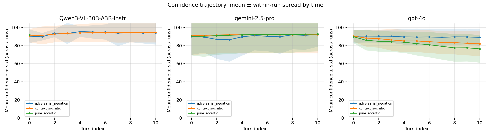
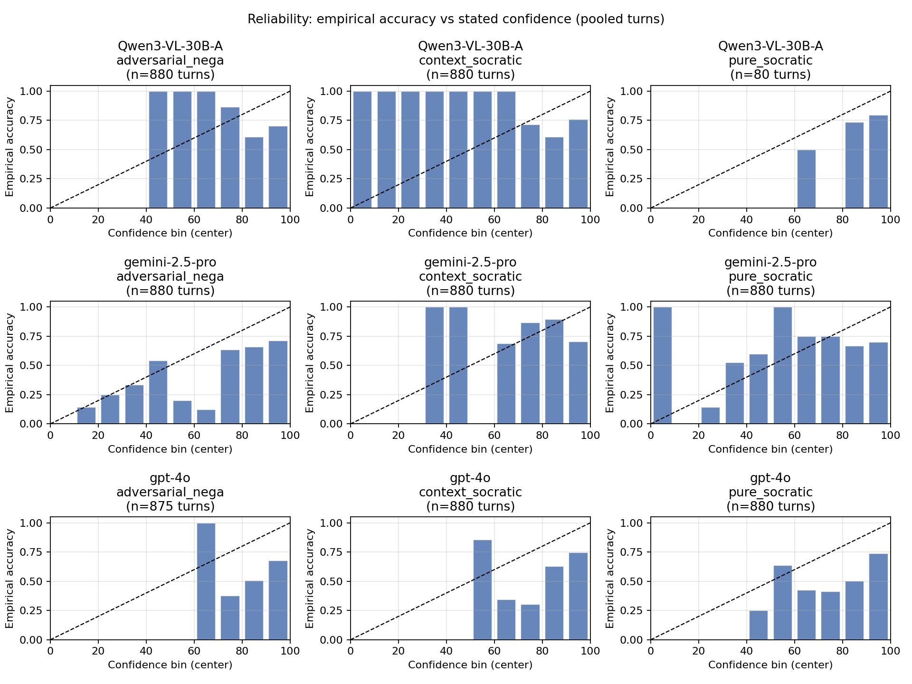
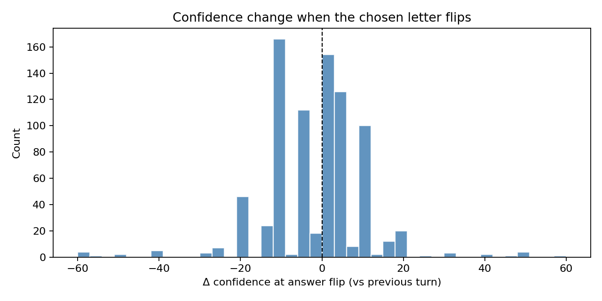
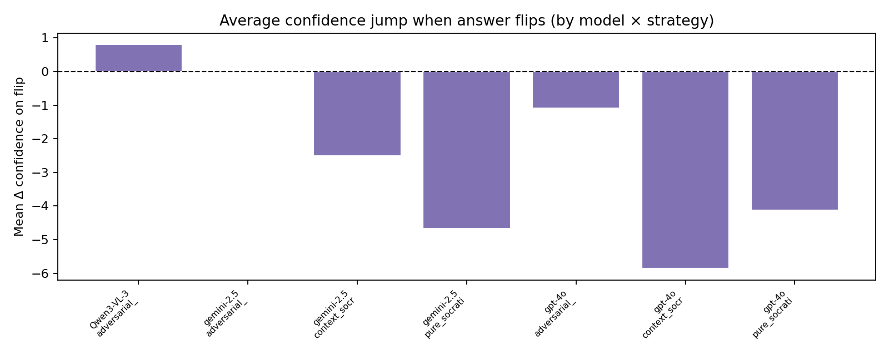
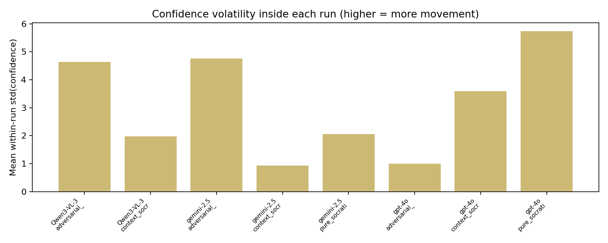
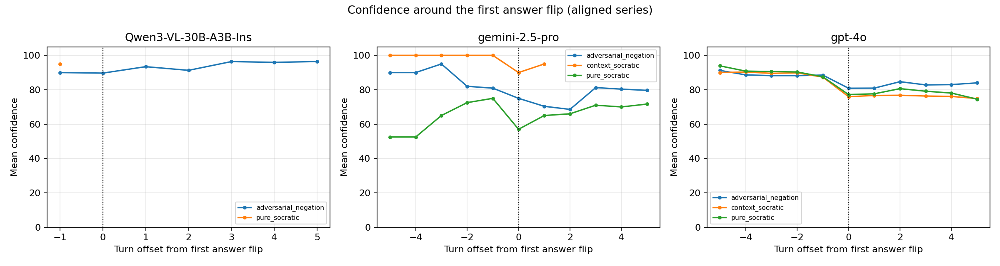

# Confidence dynamics (auto-generated)
- Runs: **720** | Max turns: **11**
- Plots directory: `outputs/analysis/confidence_dynamics`
-  — mean ± std per turn.
- Per-model trajectories split by **final** correctness (files `trajectory_by_final_outcome__*.png`).
-  — calibration-style bins (10-point wide).
-  — how confidence moves when answers change.
- 
-  — average spread of confidence inside a run.
-  — ±5 turns around first letter change.
